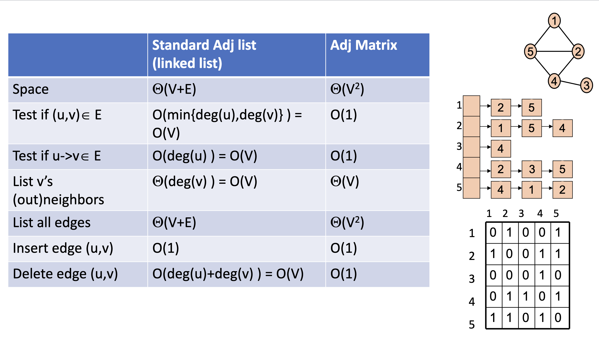

# Graph

Examples:

- Social Networks
- ML
- Computer graphics
- etc. 

Attributes:

- Denoted by `G = (V, E)`
- `V` is a set of vertices (nodes)
- `E` is a set of edges (connections between nodes)
- Graph size parameter: `n = |V|` and `m = |E|`
- Degree of a vertex: number of edges connected to it (for directed graph, in-degree and out-degree)
- Edge can be weighted or unweighted
- A tree is an indirected graph with no **cycles**

## Spanning Tree

- A tree consisting solely of edges in `G` and including all vertices in `G` in called a spanning tree
- in other words, 希望用最少的 edge 把 Graph 中的所有頂點都連接起來
- A spanning tree is not unique unless the graph is a tree
- 可以用 DFS, BFS 找出 spanning tree
- no cycle

## DAG

- A directed acyclic graph (DAG) is a directed graph with no directed cycles

## Graph 最重要的三種表示法

- Adjacency Matrix: Good for a lot of edges
- Adjacency List: Good for less edges
- Edge List (Optional): Good for less edges

> 儲存所有 node 之後可以產生應用，例如找出 spanning tree



- (無向圖) 檢查某個節點的鄰居列表是否包含另一個節點，最壞情況下需要遍歷整個鄰居列表。因此，檢查 Adjacency list 兩個節點之間是否有邊的時間複雜度為 `$O(min(deg(u), deg(v))) = O(V)$`
- (有向圖) 檢查某個節點的鄰居列表是否包含另一個節點，最壞情況下需要遍歷整個鄰居列表。因此，檢查 Adjacency list 兩個節點之間是否有邊的時間複雜度為 `$O(deg(u)) = O(V)$`

### Build Adjacency List

- Will give edges and nodes to build it
- Space complexity: V + 2E => theta(V+E) 
- Tree Space: theta(V + (V -1)) => theta(2V - 1) => theta(V)
- Complete Graph Space: theta(V + V(V-1)/2) => theta(V^2)
- Good for weighted graph


```javascript
// Eg JavaScript

const node = 3;
const edges = [[0,1],[1,2],[2,0]];
const adjacencyList = {};
for (let i = 0; i < n; i++) {
  adjacencyList[i] = [];
}
for (const e of edges) {
  adjacencyList[e[0]].push(e[1]);
  adjacencyList[e[1]].push(e[0]);
}

// another way !?
const node = 3;
const edges = [[0,1],[1,2],[2,0]];
const adjacencyList = new Array(n).fill(0).map(() => new Array());
for (const [v1, v2] of edges) {
  adjacencyList[v1].push(v2);
  adjacencyList[v2].push(v1);
}

```

> degree: number of edges connected to a node

### Build Adjacency Matrix

- Put 1 if there is an edge between two nodes, 0 otherwise
- Space complexity: theta(V^2)
- (Disadvantage) It is needed to go through all the nodes to find the neighbors of a node
- For weighted graph, we can put the weight instead of 1 in the matrix

### Build Edge List

{(1, 5), (5, 2), (2, 1), (5, 4), (4, 2), (4, 3)}

## Algorithms

TO [My Algorithms](https://github.com/chengr4/my-algorithms/tree/main/graph)

## References

- Leetcode 207
