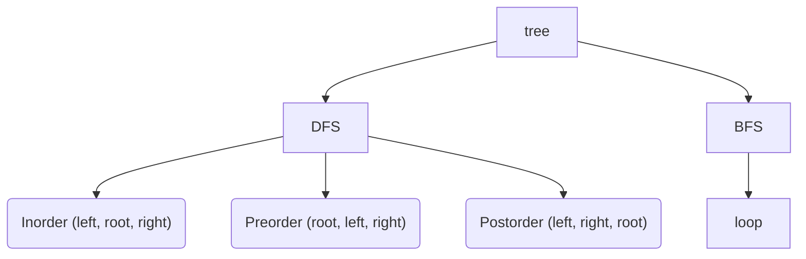

# Tree



## Application - Expression Tree

- Post-Order Traversal can be used to make a postfix expression that can be translated into machine code to be evaluated on the stack

## Binary tree

- The max number of nodes on level `i` of a binary tree is `2^(i-1)`, `i>=1`
- The max number of nodes in a binary tree of depth `k` is `2^k-1`, `k>=1`
- 用 array 表示: 易找查位置，花較多空間，刪減不易
- 用 linked list 表示：不易找查位置，花費較少空間，易刪減

## Full BT and Complete BT

- Full BT: 節點只會有 0 或 2 個子節點
- Perfect BT: A full binary tree where all the leaves are at the same depth (每個節點都有 2 個子節點)
    - Leaves: 2^h
    - Total nodes: 2^(h+1) - 1
- Complete BT: 由上至下，有左至右編號的樹

## B Tree

一顆 m 階的 b 樹基本上有以下特點:

- 每個節點內最多有 m - 1 個內部節點
- 每個節點最多有 m 個子樹
- 每個內部節點都有儲放完整資料
- 每個節點內的內部節點，都是依順序排序

## B+ Tree

- B+ tree 能夠保持資料穩定有序，其插入與修改擁有較穩定的對數時間複雜度
- B+ tree 元素由下而上插入 (vs Binary tree: top-down)
- B+ tree 比 B tree 更加穩定，因為一定都要至葉子節點才能取得資料

假設我們有一顆 m 階的 b+ 樹，它和 b 樹相比，有以下幾個特點:

- 每個節點，最多只能有 M 個子樹
- 每個節點中的內部節點，最多只能有 M - 1 個
- 每個非葉子節點(就是非最底層的節點)，只儲 index reference
- 每個葉子節點(就是最底層的節點)，儲放了實際資料
- 每個葉子節點(就是最底層的節點)，會包含一個指針，指向右邊的葉子節點

## Cheat Sheet

BFS:

```javascript
// javascript
const que = new Queue();
que.enqueue(root); // root node

while (!que.isEmpty()) {
  // important to have, because we add child node to queue and size will be changed
  const currentLevelQueueLen = que.size();
  for (let i = 0; i < currentLevelQueueLen; i++) {
    let node = que.dequeue();
    if (node) {
      // do some logic
      node.left && que.enqueue(node.left);
      node.right && que.enqueue(node.right);
    }
    
    // do other logic
  }
}
```

```golang
// golang
queue := []*TreeNode{root}

for len(queue) > 0 {
  levelLength := len(queue)
	for i := 0; i < levelLength; i++ {
	  node := queue[0]
		queue = queue[1:]
		
    if node != nil {
				queue = append(queue, node.Left)
				queue = append(queue, node.Right)
		}
    
    // do other logic
	}
}
```

DFS iterative:

```javascript
// javascript
const stack = []; // stack
let currRoot = root

while (currRoot || !stack.length > 0) {
  while (currRoot) {
    // do some logic
    stack.push(currRoot);
    currRoot = currRoot.left;
  }
  
  currRoot = stack.pop();
  // do other logic
  currRoot = currRoot.right;
}
```

## References

- [馬克;30-11 之資料庫層的核心 - 索引結構演化論 B+樹 (2019.12)](https://mark-lin.com/posts/20190911/)
