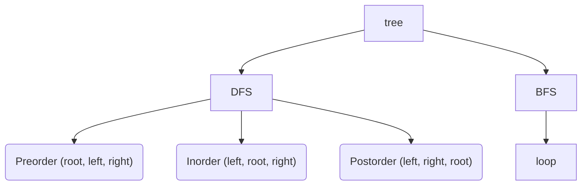

# Tree



## Binary tree

- The max number of nodes on level `i` of a binary tree is `2^(i-1)`, `i>=1`
- The max number of nodes in a binary tree of depth `k` is `2^k-1`, `k>=1`
- 用 array 表示: 易找查位置，花較多空間，刪減不易
- 用 linked list 表示：不易找查位置，花費較少空間，易刪減

## Full BT and Complete BT

- Full BT: 滿節點的樹
- Complete BT: 由上至下，有左至右編號的樹

## Binary search tree

- `==` ordered/sorted binary tree
- 必左邊 subtree 小，右邊 subtree 大

> 用 leftSize 可以找第 `k` 大的值 (?)

## Cheet Sheet

BFS:

```javascript
const queue = [root]; // root node

while (queue.length > 0) {
  // important to have, because we add child node to queue and size will be changed
  const currentLevelQueueLen = queue.length;
  for (let i = 0; i < currentLevelQueueLen; i++) {
    let node = queue.shift();
    if (node) {
      queue.push(node.left);
      queue.push(node.right);
    }
  }
}
```
